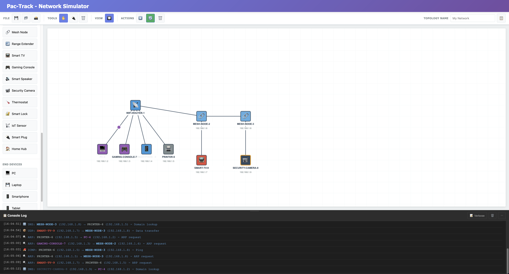

# Pac-Track - Professional Network Simulator 🌐

<div align="center">


**A powerful, browser-based network topology simulator with 38+ device types, DHCP server, continuous traffic simulation, and professional logging.**

[Features](#-features) • [Demo](#-demo) • [Installation](#-installation) • [Usage](#-usage) • [Documentation](#-documentation) • [Contributing](#-contributing)

</div>

---

## 🆕 New Modern Version Available!

**A modern React + TypeScript + shadcn/ui version is now available in the [`electron-app/`](./electron-app/) directory!**

- ⚛️ Built with **React 18** and **TypeScript 5**
- 🎨 Beautiful UI with **shadcn/ui** components
- ⚡ Lightning-fast with **Vite**
- 🖥️ Ready to package as **Electron desktop app**
- 🎯 Modern component architecture

👉 **[Check it out here →](./electron-app/)**

---

## 📸 Preview



*Create complex network topologies with an intuitive drag-and-drop interface*

---

## 🚀 Features

### 🖥️ **38+ Network Devices**
- **Network Infrastructure**: Router, Switch, Hub, Modem, Access Point, Internet/WAN, Cloud
- **Security**: Firewall, IDS/IPS
- **Servers**: Web, Database, Mail, DNS, FTP, Proxy
- **Storage**: NAS, Load Balancer
- **Home & IoT**: WiFi Router, Mesh Nodes, Range Extender, Smart TV, Gaming Console, Smart Speaker, Security Camera, Thermostat, Smart Lock, IoT Sensors, Smart Plug, Home Hub
- **End Devices**: PC, Laptop, Tablet, Smartphone, Printer

### 🔧 **Advanced Features**

#### DHCP Server
- ✅ Full DHCP implementation for routers and WiFi routers
- ✅ Automatic IP assignment to connected devices
- ✅ Configurable IP ranges and gateway
- ✅ Active leases tracking with MAC addresses
- ✅ Smart IP suggestions based on network topology

#### Continuous Traffic Simulation
- 🔄 Real-time network traffic simulation
- 📡 Multiple protocols: ARP, ICMP, TCP/HTTP, UDP, DNS
- 🎨 Color-coded packet animations
- ⚡ Adjustable simulation speed (3-second intervals)
- 🌈 Device-specific color coding in console

#### Professional Console & Logging
- 📝 **Verbose Mode**: Detailed packet information including:
  - Complete path traversal
  - Hop count
  - MAC addresses
  - Protocol-specific details (TCP flags, sequence numbers, DNS queries, etc.)
  - TTL calculations
- 🎨 **Color-coded devices**: Each device type has unique colors for easy identification
- ⏱️ Timestamped logs
- 📋 Message categorization (info, success, warning, error, packet)
- 🔍 Auto-scroll with search capability

#### Smart IP Configuration
- 🎯 **Auto-complete for IP addresses**: Intelligent suggestions based on existing networks
- 🌐 **Gateway auto-detection**: Lists all available routers/gateways
- 💡 **DHCP range suggestions**: Automatically suggests appropriate IP ranges
- ✅ **Duplicate IP prevention**: Suggests only available IPs

#### Network Topology Management
- 🎨 Drag & drop interface
- 🔌 Visual cable connections
- 🖱️ Multiple editing modes (Move, Connect, Delete)
- 🔲 **Snap to Grid**: Align devices to 50px grid for organized layouts
- 📏 **Resizable Console**: Drag to resize console panel for better visibility
- 📝 **Topology Naming**: Name and organize your network topologies
- 💾 Save/Load topologies (JSON format)
- 📸 Export topology as PNG image

#### Device Configuration
- ⚙️ Individual device configuration panels
- 🔢 IP, Subnet mask, Gateway settings
- 🔀 Routing table management (for routers)
- 🔌 Port status monitoring
- 📊 Connection tracking

### 🎯 **Packet Simulation**
- Single packet transmission simulation
- Path visualization with animation
- Protocol selection (ICMP, TCP, UDP, ARP, DNS)
- Routing logic with gateway support
- Same-network vs cross-network detection

## 🎬 Demo

### Main Interface
```
┌─────────────────────────────────────────────────────────────┐
│ Pac-Track - Network Simulator                               │
├─────────────────────────────────────────────────────────────┤
│ [File] [Tools] [Actions]                         [Console]  │
├──────┬──────────────────────────────────────────────────────┤
│      │                                                       │
│ Dev- │          Network Topology Canvas                     │
│ ices │          (Drag, Connect, Configure)                  │
│      │                                                       │
│ 📡   │                                                       │
│ 🔥   │                                                       │
│ 🌐   │                                                       │
│ 💾   │                                                       │
│ 💻   │                                                       │
├──────┴──────────────────────────────────────────────────────┤
│ Console Log                        [Verbose] [Clear] [Min]  │
│ [12:34:56] 🌐 HTTP: PC-1 → WEB-SERVER-1 - Web request      │
│     ↳ Path: PC-1 → SWITCH-1 → ROUTER-1 → WEB-SERVER-1     │
│     ↳ Hops: 3                                               │
└─────────────────────────────────────────────────────────────┘
```

## 📦 Installation

### Quick Start (No Installation Required)
Simply open `index.html` in your browser - that's it!

### Using a Local Server (Recommended)

#### Option 1: Using Python
```bash
# Python 3
python3 -m http.server 8080

# Python 2
python -m SimpleHTTPServer 8080
```

#### Option 2: Using Node.js
```bash
npm start
```

Then navigate to `http://localhost:8080`

## 📖 Usage

### Basic Workflow

1. **Add Devices**
   - Click on device buttons in the left palette
   - Devices appear on canvas at random positions
   - Use 🔲 Snap to Grid for aligned placement

2. **Connect Devices**
   - Click "Connect" button (🔌) in toolbar
   - Click first device, then second device
   - Cable connection is created automatically

3. **Configure Devices**
   - Double-click any device
   - Set IP address, subnet mask, gateway
   - For routers: Enable DHCP and configure ranges

4. **Assign IPs via DHCP**
   - Configure router with IP (e.g., 192.168.1.1)
   - Enable DHCP Server
   - Set IP range (e.g., 192.168.1.100 - 192.168.1.200)
   - Click "Assign IPs to Connected Devices"
   - All connected devices receive IPs automatically!

5. **Simulate Traffic**
   - **Single Packet**: Click ▶️ button, select source/dest, send packet
   - **Continuous Simulation**: Click 🔄 button to start/stop automatic traffic

6. **Monitor Traffic**
   - Open console (if minimized)
   - Enable "Verbose" mode for detailed information
   - Watch color-coded traffic in real-time

### Example Topologies

#### Home Network
```
Internet (WAN) → Router → WiFi Router → Switch → PC/Laptop
                                               → Smart Devices (IoT)
```

#### Enterprise Network
```
Internet → Firewall → Router → Core Switch → Access Switches
                   → DMZ (Web/Mail Servers)
                   → Cloud Services
```

#### IoT Smart Home
```
Modem → WiFi Router → Mesh Node 1 → Smart TV
                   → Mesh Node 2 → Smart Speakers
                   → Hub → Smart Thermostat/Locks/Cameras
```

## 🔧 Configuration Examples

### DHCP Configuration
```javascript
Router IP: 192.168.1.1
DHCP Range: 192.168.1.100 - 192.168.1.200
Subnet: 255.255.255.0
Gateway: 192.168.1.1 (auto-suggested)
```

### Device Configuration
```javascript
Device: PC-1
IP: 192.168.1.100 (assigned via DHCP)
Subnet: 255.255.255.0
Gateway: 192.168.1.1
MAC: AA:BB:CC:DD:EE:FF
```

## 🎨 Supported Protocols

- **ARP** 🔍 - Address Resolution Protocol
- **ICMP** 🏓 - Internet Control Message Protocol (Ping)
- **TCP** 🌐 - Transmission Control Protocol (HTTP)
- **UDP** 📦 - User Datagram Protocol
- **DNS** 🔤 - Domain Name System

## 🛠️ Technical Stack

- **Frontend**: Pure HTML5, CSS3, JavaScript (ES6+)
- **Canvas**: HTML5 Canvas API for rendering
- **Storage**: LocalStorage for preferences
- **Export**: Canvas to PNG, JSON topology files
- **No Dependencies**: 100% vanilla JavaScript

## 📊 Project Structure

```
pac-track/
├── index.html          # Main HTML file (classic version)
├── app.js             # Application logic (classic version)
├── styles.css         # Styling (classic version)
├── electron-app/      # 🆕 Modern React + TypeScript version
│   ├── src/           # React components and logic
│   ├── electron/      # Electron main/preload (optional)
│   ├── package.json   # Dependencies
│   └── README.md      # Modern version docs
├── package.json       # NPM configuration
└── README.md          # This file
```

## 🤝 Contributing

Contributions are welcome! Please feel free to submit a Pull Request.

### Development Setup
1. Fork the repository
2. Create your feature branch (`git checkout -b feature/AmazingFeature`)
3. Commit your changes (`git commit -m 'Add some AmazingFeature'`)
4. Push to the branch (`git push origin feature/AmazingFeature`)
5. Open a Pull Request

## 📝 License

This project is licensed under the MIT License - see the [LICENSE](LICENSE) file for details.

## 🙏 Acknowledgments

- Inspired by Cisco Packet Tracer
- Built for educational purposes and network visualization
- Icons: Unicode Emoji

## 📧 Contact

- Project Link: [https://github.com/yayoboy/pac-track](https://github.com/yayoboy/pac-track)
- Issues: [https://github.com/yayoboy/pac-track/issues](https://github.com/yayoboy/pac-track/issues)

## 🔮 Future Enhancements

- [ ] VLAN support
- [ ] BGP routing simulation
- [ ] Network latency simulation
- [ ] Bandwidth throttling
- [ ] Packet capture (PCAP export)
- [ ] Multi-user collaboration
- [ ] Real-time network monitoring
- [ ] Custom device creation
- [ ] Import from Packet Tracer files

---

<div align="center">

**Made with ❤️ for the networking community**

⭐ Star this repo if you find it useful!

</div>
