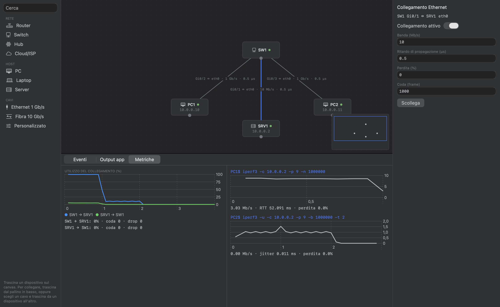

# Pac-Track

Simulatore di reti per macOS, fedele ai protocolli e realistico nei tempi: disegni una rete, la configuri e guardi ARP, switching, routing, DHCP, DNS, TCP, NAT e firewall pacchetto per pacchetto, con i campi reali di ogni header.



## Cosa fa

- **Dispositivi**: PC, laptop, server, router, switch (8, 24 o 48 porte), hub e Cloud/ISP, un router con un'uscita "Internet" simulata che risponde a ping e fa da DNS pubblico.
- **Protocolli**: Ethernet con MAC learning e ARP; IPv4 con routing statico; ICMP (ping, traceroute); DHCP (DORA, rinnovo, scadenza) e DNS (record A, cache con TTL, NXDOMAIN, nslookup); UDP e TCP (handshake, finestra, ritrasmissioni RFC 6298, fast retransmit, Reno); NAT/PAT e firewall stateful sui router.
- **Tempo**: modalità Realtime (da 0.1× a 100×) e Simulation (orologio fermo, un evento alla volta). Stesso seed e stessa rete danno la stessa simulazione.
- **Osservare**: lista eventi filtrabile e ispettore PDU header per header; pacchetti colorati per protocollo sui cavi; tabelle live (ARP, MAC, routing, NAT, lease DHCP, cache DNS, connessioni TCP); generatore di traffico TCP/UDP con metriche (utilizzo e code dei cavi, throughput, RTT, jitter, perdita).
- **Documento**: file `.ptk` (JSON) con apertura, salvataggio automatico, versioni e finestre multiple di macOS; annulla e ripeti; esportazione PNG del canvas.

## Requisiti

macOS 15 o successivo. Per compilare: Swift 6 con i soli Command Line Tools (`xcode-select --install`); Xcode non serve.

## Installazione

```sh
scripts/bundle.sh          # crea build/PacTrack.app (release, icona, firma ad-hoc)
open build/PacTrack.app
```

Per tenerla, trascina `build/PacTrack.app` in Applicazioni.

## Primi passi

1. Trascina dalla palette uno switch e due PC; collegali trascinando dal pallino in basso di un dispositivo all'altro (oppure scegli un cavo nella palette, o lo strumento **Collega**).
2. Seleziona il primo PC: nell'ispettore, scheda *Interfacce*, scrivi `10.0.0.1/24` e premi Invio; al secondo `10.0.0.2/24`.
3. Tasto destro sul primo PC ▸ *Ping verso* ▸ il secondo: in basso è aperta la scheda *Eventi* con i pacchetti; l'output del ping è nella scheda *Output app*.
4. Passa a *Simulation* nella barra e premi `.` per avanzare un evento alla volta; un clic su un evento mostra la sua PDU.
5. Per uscire su Internet: aggiungi una *Cloud/ISP* (Gi0/0 già su `203.0.113.1/24`), dai al tuo router `203.0.113.2/24` verso di lei, la route `0.0.0.0/0` via `203.0.113.1` e il NAT (*Servizi*); i PC, con il router come gateway, usano `8.8.8.8` come DNS e raggiungono `www.example.com`.

Scorciatoie: V sposta, C collega, Canc elimina, Spazio avvia o ferma, `.` passo, Cmd+Z e Cmd+Shift+Z, Cmd+C, Cmd+V, Cmd+D, Cmd+A, Cmd+S, Cmd+O, Cmd+Shift+E esporta l'immagine. Shift-clic e Shift-trascina selezionano più dispositivi.

## Sviluppo

```sh
scripts/test.sh                          # test (Swift Testing) con i soli Command Line Tools
scripts/selftest.sh build/selftest.png   # avvia l'app, esegue uno scenario scriptato e salva le schermate
```

- `Sources/PacEngine`: motore a eventi discreti in Swift puro (solo Foundation).
- `Sources/PacKit`: comandi e snapshot, formato file, actor della simulazione, editor con annulla e ripeti.
- `Sources/PacTrack`: app SwiftUI.
- `docs/superpowers/specs`: specifica; `docs/superpowers/plans`: piani delle milestone; `docs/manual-checks`: verifiche manuali.

Convenzioni: testi dell'interfaccia in italiano; codice, commenti e commit in inglese; ogni funzione nuova parte da un test che fallisce.

## Fuori perimetro

Wi-Fi, VLAN 802.1Q, STP, routing dinamico (RIP, OSPF), IPv6, CLI per dispositivo, applicazioni oltre DNS e DHCP.

## Licenza

MIT, vedi [LICENSE](LICENSE).
